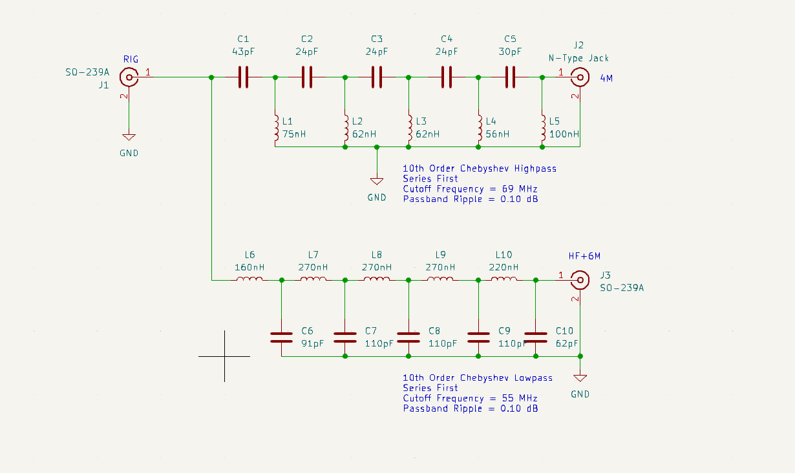

# diplexer
HF+6M lowpass and 4M highpass

Higpass Ltspice analysis setup:

Highpass frequency analysis ( insertion loss, insertion phase, and return loss):

Highpass Z-in and Z out analysis:

Lowpass LTspice analysis setup:

Lowpass filter frequency analysis ( insertion loss, insertion phase, and return loss):

Lowpass filter Z-in and Z out:

Shematic for the diplexer:

Inductors:

https://github.com/Supermagnum/diplexer/blob/main/Inductors.pdf

All caps are 2220 (5750 Metric) SMD RF Microwave / High Q ceramic.

They should handle up to 1KW.

Connectors are:
2 X Amphenol part number: 	172117

1 X Amphenol part number: 	83-1R

