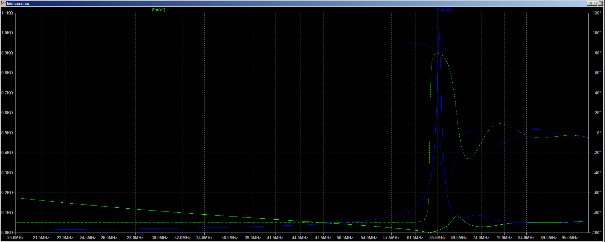
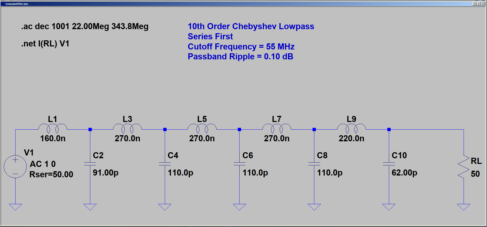

# diplexer
HF+6M lowpass and 4M highpass

Higpass Ltspice analysis setup:

Highpass frequency analysis ( insertion loss, insertion phase, and return loss):

Highpass Z-in and Z out analysis:

Lowpass LTspice analysis setup:

Lowpass filter frequency analysis ( insertion loss, insertion phase, and return loss):

Lowpass filter Z-in and Z out:

Shematic for the diplexer:

