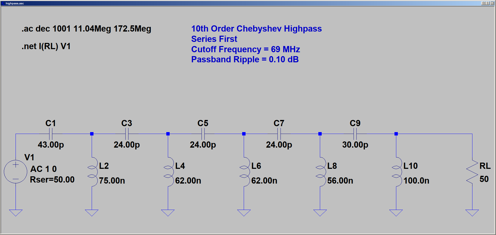
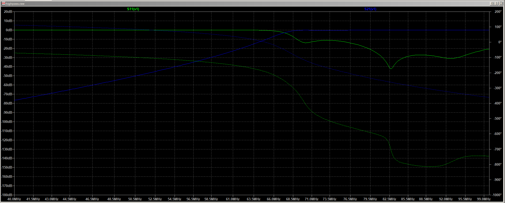

# diplexer
HF+6M lowpass and 4M highpass

The lowpass filter has: 71.5mhz -42dB. 
Highpass filter 52.5mhz -45dB. 50.5mhz -50db

Highpass Ltspice analysis setup:

Highpass frequency analysis ( insertion loss, insertion phase, and return loss):

Highpass Z-in and Z out analysis:

Lowpass LTspice analysis setup:

Lowpass filter frequency analysis ( insertion loss, insertion phase, and return loss):

Lowpass filter Z-in and Z out:

PCB board screenshot:

I had to draw the 1111 SMD footprint because it wasn't included in the Kicad database.
I hope that I haven't messed up.
Shematic for the diplexer:
https://raw.githubusercontent.com/Supermagnum/diplexer/refs/heads/main/diplexer.pdf

BOM for capacitors and connectors:
https://github.com/Supermagnum/diplexer/blob/main/BOM.xls

Inductors:
You have to make these yourself!
https://github.com/Supermagnum/diplexer/blob/main/Inductors.pdf

Suitable box:
https://www.hammfg.com/part/1457N1601E

All bolt holes is M3.

PCB boards and assembly:

